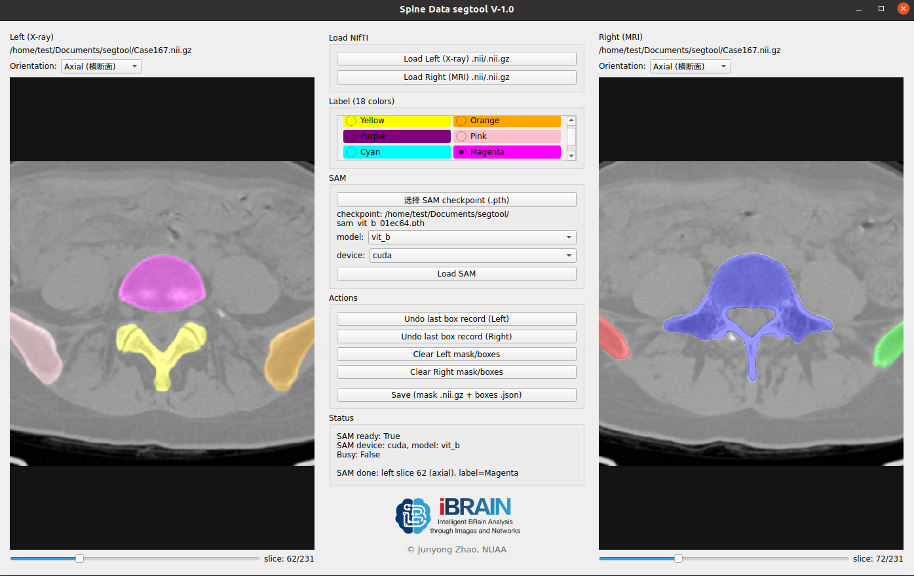
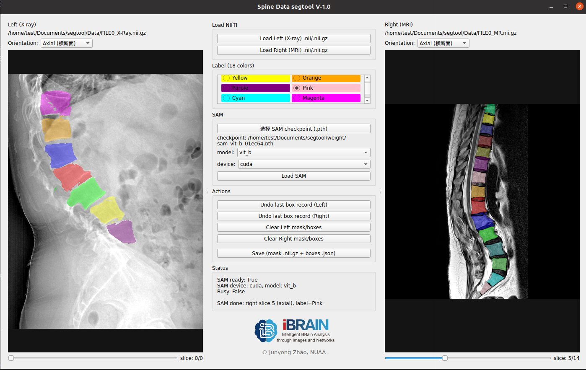

# Sepine segmentation Tool (SegTool)
⭐️ ⭐️ ⭐️This software can load data, manually select bounding boxes, segment data, and save the segmentation results.


## 1. Requirements
```
conda create -n segtool python=3.8
conda activate segtool
pip install -r requirements.txt
pip install -r requirements-sam.txt
```
## 1. Dataset
We provide sample data and support loading  one or two modal data. The sample dataset can be found [here](Data)
## 2. Weight Download
vit_h: [ViT-H SAM model](https://dl.fbaipublicfiles.com/segment_anything/sam_vit_h_4b8939.pth)

vit_l: [ViT-l SAM model](https://dl.fbaipublicfiles.com/segment_anything/sam_vit_l_0b3195.pth)

vit_b: [ViT-b SAM model](https://dl.fbaipublicfiles.com/segment_anything/sam_vit_b_01ec64.pth)
## 3. Run
```
./run.sh
```
## 4.Save Result
We can save the mask and bounding box coordinates in .nii.gz and .json formats, respectively.

## Windows use

Packaging segtool into an executable file
Packaging Windows .exe

**Note: Windows .exe needs to be packaged on a Windows system!**

Using a batch script (Recommended)

1. **On a Windows system** (Requires Python 3.8+)

2. **Run the packaging script**:

``cmd

build_windows.bat

```

3. **Run the executable file**:

- After packaging, find `segtool.exe` in the `dist` directory

- You can directly double-click to run it.
